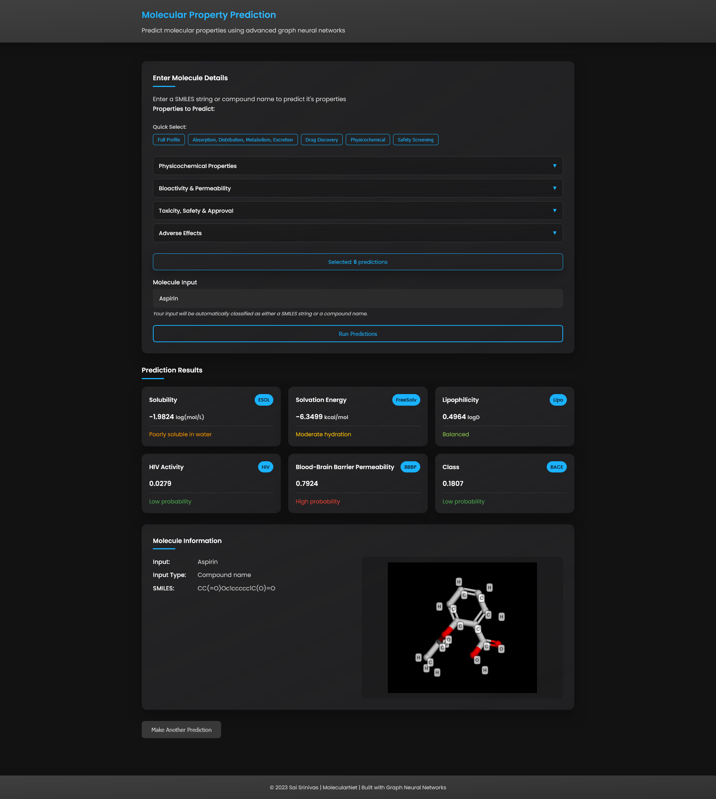

# Molecular Property Prediction

Predict properties of chemical compounds using graph neural networks. This project helps you figure out things like solubility, toxicity, and binding affinity by looking at molecular structures.

For detailed documentation and implementation, refer to the [full documentation](https://saisrinivas-samoju.github.io/MoleculeNet/).

## What It Does

Takes molecular data (SMILES strings) and predicts properties using graph neural networks. Works for both regression tasks (like predicting solubility values) and classification tasks (like predicting whether something is toxic).

Supports datasets like ESOL, FreeSolv, Lipophilicity, HIV, BACE, BBBP, SIDER, and ClinTox.

## Quick Start

### Installation

```bash
git clone https://github.com/saisrinivas-samoju/MoleculeNet.git
cd MoleculeNet

# Install dependencies
pip install -r requirements.txt
```

Or install directly:

```bash
pip install cirpy deepchem mango mlflow pandas plotly rdkit seaborn torch torch-geometric fastapi uvicorn
```

### Basic Usage

```python
from src.data_loader import MoleculeDataset
from src.data_preprocessor import Preprocessor
from src.data_splitter import DataSplitter, ShuffleSplit
from src.model_architecture import MoleculeNetRegressor
from src.train import setup_training
from src.predict import predict_molecule
import torch

# Load and preprocess data
dataset = MoleculeDataset(
    root='datasets/processed',
    name='ESOL',
    filepath='datasets/csv_files/delaney-processed.csv',
    smiles_colname='smiles',
    label_colname='ESOL predicted log solubility in mols per litre'
)

preprocessor = Preprocessor(dataset, task_type='regression')
processed_dataset = preprocessor.preprocess()

# Split data
splitter = DataSplitter()
splitter.set_strategy(ShuffleSplit())
train_loader, val_loader, test_loader = splitter.split_data(processed_dataset, batch_size=32)

# Train model
device = torch.device('cuda' if torch.cuda.is_available() else 'cpu')
model = MoleculeNetRegressor(
    num_features=processed_dataset[0].num_features,
    hidden_dim=64,
    layer_type='gcn'
)
model = model.to(device)

model, optimizer, history, best_metrics = setup_training(
    model=model,
    train_loader=train_loader,
    val_loader=val_loader,
    device=device,
    task_type='regression'
)

# Make a prediction
smiles = "CC(=O)OC1=CC=CC=C1C(=O)O"  # Aspirin
prediction = predict_molecule(model, smiles, device, task_type='regression')
print(f"Predicted solubility: {prediction:.4f} log(mol/L)")
```

### Web Interface

Start the web server to make predictions through a browser:

```bash
uvicorn app:app --reload
```

Then open http://localhost:8000 in your browser. You can enter SMILES strings or compound names to get predictions from your trained models.



*Example prediction for aspirin using the drug discovery preset*

## Features

- Load data from CSV files with SMILES strings
- Automatic molecular graph construction
- Multiple graph neural network architectures (GCN, GAT, GraphSAGE)
- Support for both regression and classification tasks
- Model evaluation with comprehensive metrics
- Save and load trained models
- Web interface for easy predictions
- Model registry to manage multiple models
- 3D molecular visualization

## Project Structure

- `src/` - Main source code (data loading, preprocessing, models, training, etc.)
- `datasets/` - Dataset files and processed data
- `models/` - Saved trained models
- `docs/` - Documentation source
- `app.py` - FastAPI web application
- `main.py` - Training pipeline entry point
- `model_registry.json` - Model registry configuration
